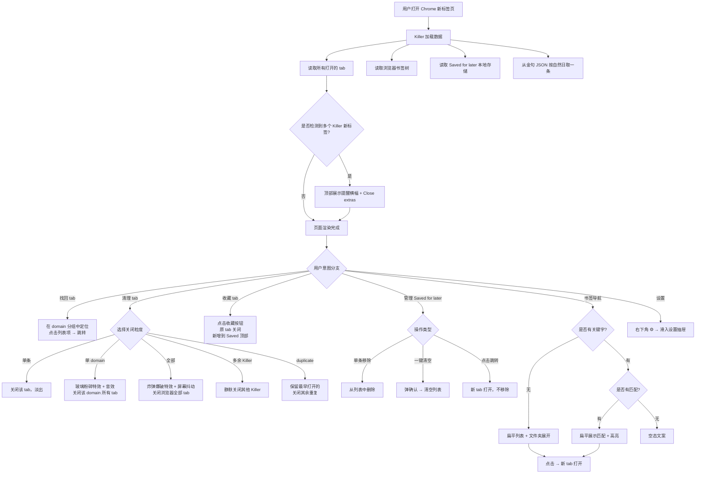

# PRD-001 · Tab Killer v1.0

| 字段 | 内容 |
|---|---|
| 版本 | v1.0 |
| 状态 | Draft（已与用户逐故事确认，待落地） |
| 创建日期 | 2026-04-17 |
| 作者 | novin.shao@gmail.com |
| 项目定位 | Builder 模式：自用 + 开源分享（不追求商业化） |
| 分发渠道 | GitHub Release（手动 load unpacked） |

---

## 1. 背景与目标

### 1.1 问题陈述
Chrome 打开大量 tab 后，顶部栏会把 tab 堆叠压缩成一堆小图标，用户想切换到某个特定页面时面临：
- 肉眼难辨（图标太小、标题看不见）
- Chrome 原生 `⌘⇧A` Tab Search 体验不够用
- `⌘+1..9` 只能切前 9 个
- `Ctrl+Tab` 线性切换，tab 多了效率极低

### 1.2 产品目标
替换 Chrome 新标签页，打开新标签即进入一个按 **domain 自动分组** 的 tab 管理面板。用户无需手动整理即可：
1. 快速看见浏览器当前的 tab 负担全貌
2. 按 domain 心智锚点定位到目标 tab 并跳转
3. 一键清理冗余 tab（单条 / 单 domain / 全部 / 多余 Killer）
4. 将"稍后再看"的页面归档到 Saved for later，等待重拾

### 1.3 非目标（明确不做）
- AI 按"工作/调研/购物"这类任务语义分组（主观、错误成本高）
- 模糊搜索 tab（v2 再做，MVP 仅做书签关键字搜索）
- 缩略图网格墙（v2 再做）
- 深色模式（v2 再做，MVP 仅浅色米白暖色调）
- 打星标 / 永久书签化 / 跨设备同步（与 Chrome 原生书签分工，Killer 只做会话级 Saved for later）
- Chrome Web Store 上架（v1 仅 GitHub Release）

### 1.4 术语表
| 术语 | 含义 |
|---|---|
| Killer / Tab Killer | 本插件的代称 |
| New Tab 接管 | 插件覆盖 Chrome 的 `chrome://newtab/` |
| domain | 指 tab URL 的完整 hostname（如 `docs.google.com`，不合并为 google.com） |
| Saved for later | 待重拾列表，用户标记"稍后再看"的页面归档位 |
| 多 Killer | 用户同时打开了多个 Killer 新标签页 |
| 爆破特效 | 关闭 domain 或全部 tab 时触发的赛博风视觉/音效 |

---

## 2. 用户画像与使用场景

### 2.1 用户画像
- **核心用户**：重度 tab 用户（开发者、研究者、多线任务工作者），每个浏览器常驻 20~50 个 tab
- **动机**：同时在工作/调研/学习多个话题，习惯把相关页面都开着作为"外脑"
- **痛点**：tab 数超过某个阈值后切换成本陡增，又舍不得关

### 2.2 核心使用场景
1. **打开新标签作日常仪表盘**：每次按 `⌘+T` 都能看到 tab 负担全貌 + 心情调节（金句）
2. **找回某个已打开页面**：大脑记忆索引是 domain（"那是个 GitHub repo"）→ 在分组网格中按 domain 定位 → 点击跳转
3. **清理冗余 tab**：下班收工、一天结束时一键关掉某个 domain / 全部 tab
4. **稍后再看**：临时收到的微信链接想稍后深入读 → 收藏进 Saved for later → 关掉原 tab
5. **书签快速导航**：左侧抽屉召唤出所有 Chrome 书签

---

## 3. 整体布局架构（方向 A）

主界面为**极简三栏**布局：

```
┌─[📚 抽屉热区]────────────────────────────────────────────┐
│                                                          │
│                      主区域                              │
│   欢迎语 + 金句                                          │
│   提醒横幅（条件）                                        │
│   Open tabs（domain 分组网格） + Saved for later         │
│                                                          │
│                                            [⚙ 设置]      │
└──────────────────────────────────────────────────────────┘
```

- **左侧边缘**：40px 宽的书签抽屉触发热区 + 📚 icon（默认收起）
- **主区域**：承载所有核心内容
- **右下角**：固定设置 icon（不随滚动）
- **主题**：浅色米白暖色调，MVP 不做深色模式

### 3.1 响应式断点

| 屏幕/剩余宽度 | domain 网格列数 | Saved 位置 |
|---|---|---|
| ≥ 1440px | 4 列 | 右侧并排 |
| 1200 ~ 1439px | 3 列 | 右侧并排 |
| 900 ~ 1199px | 2 列 | 折叠到下方 |
| < 900px | 1 列 | 折叠到下方 |

书签抽屉展开时，按**主区域剩余宽度**判定断点，不按整窗宽度。

---

## 4. 阶段地图（用户旅程）

```
┌────────────────────────────────────────────────────────┐
│  阶段 0：首次安装 & 接入（US-01）                        │
└────────────────────────────────────────────────────────┘
                        ↓
┌────────────────────────────────────────────────────────┐
│  阶段 1：打开新标签 → 落地 Killer（US-02, US-03）         │
└────────────────────────────────────────────────────────┘
                        ↓
┌────────────────────────────────────────────────────────┐
│  阶段 2：速览当前状态（US-04）                            │
└────────────────────────────────────────────────────────┘
                        ↓
┌────────────────────────────────────────────────────────┐
│  阶段 3：找回 & 清理打开中的 tab（US-05, US-06, US-07）   │
└────────────────────────────────────────────────────────┘
                        ↓
┌────────────────────────────────────────────────────────┐
│  阶段 4：标记 & 管理待重拾（US-08, US-09）                │
└────────────────────────────────────────────────────────┘
                        ↓
┌────────────────────────────────────────────────────────┐
│  阶段 5：书签快捷导航（US-10, US-11）                     │
└────────────────────────────────────────────────────────┘

（贯穿）设置页：US-12
```

---

## 5. 核心用户操作流



---

## 6. 用户故事清单

| ID | 标题 | 阶段 |
|---|---|---|
| US-01 | 用户通过 GitHub Release 安装 Tab Killer 并接管新标签页 | 0 |
| US-02 | 打开新标签页 → 落地 Tab Killer 首屏 | 1 |
| US-03 | 首屏展示时段问候语与当日金句 | 1 |
| US-04 | 首屏提供全局统计数据，并在多 Killer 时提醒收敛 | 2 |
| US-05 | 按完整 hostname 分组展示已打开 tab，点击跳转 | 3 |
| US-06 | 以三种粒度关闭 tab，并在关 domain/全部时触发赛博特效 | 3 |
| US-07 | 检测并合并重复 tab | 3 |
| US-08 | 将 tab 收藏到 Saved for later | 4 |
| US-09 | 管理 Saved for later 列表 | 4 |
| US-10 | 书签抽屉 hover 展开，扁平 + 文件夹层级 | 5 |
| US-11 | 书签关键字搜索 | 5 |
| US-12 | 设置页 | 贯穿 |

---

## 7. 用户故事详细定义

### US-01｜用户通过 GitHub Release 安装 Tab Killer 并接管新标签页

**背景与用户价值**
开发者/重度 tab 用户在 GitHub 发现 Tab Killer 开源项目，下载 zip 手动加载到 Chrome。装完后打开任意新标签即进入 Killer 界面，无需注册账号、无引导页。

**业务规则**
- **R1 分发**：仅走 GitHub Release，提供 zip + README 安装说明；不走 Chrome Web Store
- **R2 权限**：声明 `tabs` / `bookmarks` / `storage` / `chrome_url_overrides.newtab`；不申请 `history`
- **R3 接管**：安装即生效；用户可在设置页关闭接管，开关立即生效（写入 storage 后实时刷新）
- **R4 数据初始化**：首次打开 Saved for later 空、金句队列加载本地 20 条 JSON
- **R5 冲突**：与其他 New Tab 插件冲突由 Chrome 原生机制处理，Killer 自身不介入
- **R6 无引导页**：不做一次性欢迎弹窗，依赖各模块空态文案传递信息

**异常路径**
- **E1** 书签权限被事后撤销 → 书签区展示空态 `"书签权限没给我呀 🥲 去 chrome://extensions 开一下？"`
- **E2** 本地 storage 写入失败 → 静默失败，下次操作重试，不阻塞主流程
- **E3** 接管开关关闭 → New Tab 回到 Chrome 原生，插件本身保留，可随时重新开启

**验收标准**
1. 从 GitHub Release 下载 zip，按 README 步骤加载，插件出现在 `chrome://extensions` 列表
2. 装完后打开新标签 → 自动进入 Killer 界面
3. 在设置页关闭"New Tab 接管"→ 当前及后续打开的新标签恢复 Chrome 原生；再次开启 → 立即恢复
4. 首次打开：Saved for later 为空态、金句正常显示、书签可正常读取
5. 事后在 `chrome://extensions` 撤销 bookmarks 权限 → 书签区显示 E1 文案
6. 模拟 storage 写入失败 → 主流程不崩溃、不弹错、下次操作重试

**依赖**：无上游；下游 US-02、US-12

---

### US-02｜打开新标签页 → 落地 Tab Killer 首屏

**背景与用户价值**
用户打开 Chrome 新标签时，看到一个结构清晰、情绪松弛的 Killer 首屏。各模块数据异步加载，骨架屏占位避免闪动。屏幕宽度变化时布局自适应。

**业务规则**
- **R1 页面区域划分**：左边缘书签抽屉触发热区（40px）+ 📚 icon；主区域自上而下为欢迎语/金句 → 提醒横幅（条件）→ Open tabs 网格 + Saved for later；右下角固定 ⚙ 设置 icon
- **R2 渲染顺序**：页面骨架立即渲染，不等待数据；各数据源（storage / `tabs.query` / `bookmarks.getTree`）异步拉取，独立填充，不互相阻塞
- **R3 加载态**：数据未到达时展示浅色骨架块；骨架 opacity 0.4↔0.8 淡入淡出呼吸动效（不用 shimmer 扫光）；数据到达后骨架淡出、内容淡入（~200ms）
- **R4 响应式断点**：见 §3.1；书签抽屉展开时按主区域剩余宽度重判
- **R5 滚动行为**：页面整体一个滚动容器；书签抽屉内独立滚动；设置 icon `position: fixed`
- **R6 书签抽屉交互**：hover 左侧 40px 热区 → 抽屉从左滑入 ~200ms；鼠标离开热区 → 自动收起 ~200ms；展开宽度 ~280px；内部可点击文件夹展开/收起
- **R7 主题**：MVP 仅浅色米白暖色调一套，不做深色或跟随系统

**异常路径**
- **E1** `tabs.query` 返回空 → Open tabs 空态（US-05 定义）
- **E2** `bookmarks.getTree` 抛错 → 书签抽屉显示 US-01 E1 文案
- **E3** 数据拉取超 3 秒未到 → 骨架屏持续呼吸，不转错误态
- **E4** 用户在数据加载途中关闭该 tab → 无副作用

**验收标准**
1. 打开新标签 → 500ms 内看到完整页面结构（骨架或内容）
2. 首屏区域顺序正确：欢迎语 → 金句 → 提醒横幅（如适用）→ Open tabs → Saved
3. 各模块数据到达后骨架淡出、内容淡入，无闪动
4. 设置 icon 固定在右下角，滚动时位置不变
5. 调整窗口宽度经过 1440 / 1200 / 900 断点时，布局按 R4 切换
6. 展开书签抽屉：主区域按剩余宽度重新计算列数；收起：按窗口宽度计算
7. hover 左侧 40px 热区：200ms 内抽屉滑入；鼠标滑出：200ms 内收起
8. 抽屉内点击文件夹：展开/收起其下书签，不关闭抽屉
9. 撤销书签权限后再打开：书签抽屉展示 US-01 E1 文案，其他模块正常
10. 模拟数据延迟 5s：骨架屏持续呼吸，不变错误态

**依赖**：上游 US-01；下游 US-03~US-11 都落在本故事容器内

---

### US-03｜首屏展示时段问候语与当日金句

**背景与用户价值**
用户每次打开新标签，第一眼接收情绪性内容——问候语按时段变化、金句按自然日轮换。让打开新标签有"翻开一本书"的松弛感，削弱工具感。

**业务规则**

**R1 问候语时段映射**（本地时区）

| 时间段 | 中文 | 英文 |
|---|---|---|
| 05:00 ~ 11:59 | 早上好 | Good morning |
| 12:00 ~ 17:59 | 下午好 | Good afternoon |
| 18:00 ~ 22:59 | 晚上好 | Good evening |
| 23:00 ~ 04:59 | 夜深了 | Good night |

**R2 日期格式**
- 中文：`2026 年 4 月 17 日 · 周五`
- 英文：`FRIDAY, APRIL 17, 2026`

**R3 双语机制**
- 默认跟随 `chrome.i18n.getUILanguage`（中文浏览器→中文，其他→英文）
- 用户可在设置页的"语言"下拉切换
- 切换影响：UI 文案、问候语、日期格式
- **不影响**：金句本身（金句库保持中文，保留韵味）

**R4 金句数据结构**（`/data/quotes.json`）
```json
[
  { "id": "q001", "text": "山川异域，风月同天。", "author": "鉴真", "source": "《东征传》" }
]
```
- `text` / `author` / `source` 展示给用户；`id` 仅内部用

**R5 金句取句算法**
- 维护 `unshown_queue` + `shown_queue` 两份本地 storage
- 首次初始化：`unshown = 全部id`、`shown = []`
- 记录 `last_shown_date` 和 `current_quote_id`
- 跨过本地时区 00:00 → 从 `unshown` 随机弹一条，移到 `shown`，更新 `current_quote_id`
- 同日多次打开 → 直接展示 `current_quote_id`
- `unshown` 空时 → 将 `shown` 重新洗牌回 `unshown`，清空 `shown`

**R6 金句样式**
- 金句字号 < 欢迎语；行距更大
- 正文用英文引号 `"..."` 包裹
- 出处另起一行：`—— 作者《著作》`，浅灰色
- 单条正文字数 ≤ 60

**R7 金句校验**
- 加载 JSON 时逐条校验：字段完整 + `text.length ≤ 60`
- 不通过则跳过，不进入队列
- 校验后队列为空 → 不展示金句行，仅保留欢迎语 + 日期

**异常路径**
- **E1** JSON 读取失败 / 解析错误 → 不显示金句行，不报错
- **E2** storage 读写失败 → 回退到"按日期取模"展示（不维护队列），保证仍有金句
- **E3** 所有金句都超长被过滤 → 不显示金句行

**验收标准**
1. 本地 14:00 打开 → 中文界面显示"下午好"、英文显示"Good afternoon"
2. 日期格式与界面语言对应
3. 同一天多次打开：金句保持不变
4. 跨过本地 00:00 → 金句换一条
5. 20 条展示完一轮 → 自动重新洗牌
6. 设置页切换语言：UI/问候/日期立即变化；金句保持中文
7. JSON 放一条 70 字的金句 → 被跳过
8. JSON 放一条缺 `author` 的金句 → 被跳过
9. 删除 JSON 文件 → 页面不崩溃，金句行不显示，其他模块正常
10. 模拟 storage 读写失败 → 回退按日期取模仍能展示

**依赖**：上游 US-02；下游 US-12（语言切换）

---

### US-04｜首屏提供全局统计数据，并在多 Killer 时提醒收敛

**背景与用户价值**
用户一眼看到当前浏览器的 tab 负担（domain 数 / tab 数 / saved 数），快速建立认知。若不小心开了多个 Killer，给温和提醒 + 一键清理入口。

**业务规则**
- **R1 统计展示位置**：Open tabs 标题右侧 `X domains · [× Close all N tabs]`；Saved for later 标题右侧 `N item(s) · [× Clear all]`；书签抽屉顶部 `N bookmarks`；不做独立统计卡片
- **R2 统计范围**：统计所有 Chrome 窗口；`domains 数` = 所有 tab 按 hostname 去重 count；`tabs 数` = 全部 tab（含 Killer 自身）；`saved 数` = 本地 storage 数组长度
- **R3 实时更新**：监听 `tabs.onCreated` / `onRemoved` / `onUpdated` / `onMoved` + storage 变化 → 数值立即更新
- **R4 多 Killer 提醒横幅**：当前 Killer tab 数 ≥ 2 触发；位置在欢迎语/金句下方、Open tabs 上方；内容含图标 + 文案（中/英）+ 主按钮 `× Close extras` + 右上 `×` 忽略；出现动画：从上方滑入 + 淡入（~200ms）
- **R5 Close extras 行为**：关闭除当前这一个之外的所有 Killer tab；横幅自动消失；统计实时回落；不弹确认
- **R6 横幅忽略机制**：点右上 `×` → 横幅消失，**仅本次会话**不再展示；刷新 Killer 页则重置；新开的 Killer 独立判定，不继承忽略状态

**异常路径**
- **E1** `tabs.query` 抛错 → 统计数值显示 `—`，横幅不触发
- **E2** Close extras 过程中某 tab 关闭失败 → 继续关剩下，不弹错
- **E3** Close extras 执行中用户切到其他 Killer tab → 该 tab 不会被关（基于发起时 tabId）

**验收标准**
1. 开 1 个 Killer + 5 个其他跨 3 domain → 显示 `3 domains · Close all 6 tabs`
2. Chrome 里手动关一个 tab → 数值实时 -1
3. 开第二个 Killer → 两个 Killer 页都出现横幅
4. 点 Close extras → 另一个 Killer 被关，当前保留，横幅消失，统计更新
5. 横幅出现：从上方滑入 + 淡入 ~200ms
6. 点右上 × → 横幅消失
7. 忽略后再开第三个 Killer → 当前 Killer 不再弹，但第三个会弹
8. 刷新当前 Killer → 横幅重新出现
9. 模拟 `tabs.query` 抛错 → 统计显示 `—`，页面不崩
10. Close extras 中某 tab 已被手动关 → 不抛错，继续关剩下

**依赖**：上游 US-01、US-02；下游 US-06

---

### US-05｜按完整 hostname 分组展示已打开 tab，点击跳转

**背景与用户价值**
MVP 核心破局点。用户打开新标签，最醒目的视觉是按 domain 自动分组的卡片网格，无需手动整理。点击任一列表项即可跳转到原 tab。

**业务规则**
- **R1 分组粒度**：按完整 hostname 分组；`docs.google.com` / `mail.google.com` / `drive.google.com` 各自独立卡片；不按 eTLD+1 合并
- **R2 特殊 tab 处理**：隐藏 Killer 自身；其他 tab（http/https/chrome:///file:///about:blank）全部显示
- **R3 卡片标题提取算法**（优先级）：
  1. 本地 hostname→友好名映射表（MVP 维护 ~30 个：`mail.google.com→Gmail`、`docs.google.com→Google Docs`、`feishu.cn→飞书`、`mp.weixin.qq.com→公众号` 等）
  2. 无映射：从组内第一个 tab 的 `title` 按分隔符 `-` / `|` / `·` / `—` 切分，取**最后一段**
  3. 仍失败：用 hostname 字符串兜底
- **R4 卡片 logo**：数据源 `chrome://favicon/[tab.url]`，宽高 ≥ 24px 才使用；fallback：hostname 首字母大写的彩色圆形（颜色对 hostname 做稳定 hash，映射到预置 6~8 色板）
- **R5 卡片排序**：主序按卡片内 tab 数降序；次序（并列时）按首次出现 tab 的打开时间升序
- **R6 卡片内 tab 排序**：按 Chrome tab 索引；跨窗口先按 windowId，再按窗口内 index
- **R7 单卡片 tab 数上限**：≤5 全部展开；>5 默认前 5 条，尾部 `还有 N 个 · 展开` 按钮；点击展开 → 全部显示 + `收起`；状态仅本次会话记忆
- **R8 列表项展示**：`[favicon] [标题] [🔖 收藏] [× 关闭]`；标题过长截断 + `...`，最大宽度约卡片宽度的 70%；收藏/关闭按钮仅 hover 时显示；duplicate 标记由 US-07 定义
- **R9 列表项点击行为**：`tabs.update(tabId, { active:true })` + `windows.update(windowId, { focused:true })`；当前 Killer tab 保留
- **R10 空态**：过滤后无任何 tab → 单色线条插画 + `Tab 界当前太平无事`
- **R11 实时刷新**：监听 `tabs.onCreated`/`onRemoved`/`onUpdated`/`onMoved` → 重算分组、排序、列表；新增/移除淡入淡出 ≤200ms

**异常路径**
- **E1** `tabs.query` 抛错 → 静默失败，展示空态文案
- **E2** 跳转时目标 tab 已被外部关闭 → 捕获异常，不弹错，触发 tabs 刷新
- **E3** favicon 加载失败 / 超时（>1s）→ 用字母圆 fallback
- **E4** 映射表和 title 清洁提取都失败 → 显示完整 hostname

**验收标准**
1. 打开分属 4 个 hostname 的 7 个 tab → 显示 4 张卡片
2. 同时开 `docs.google.com` + `mail.google.com` → 2 张独立卡片
3. 卡片标题符合 R3 算法
4. 卡片按 tab 数降序排列
5. 卡片内 tab 按 Chrome 索引顺序排列
6. 1 个 Killer + 5 个其他 → Open tabs 显示 5 个，不含 Killer
7. 打开 `chrome://extensions` / 本地 file:// → 作为卡片显示（不被隐藏）
8. 飞书开 8 个 tab → 默认显示前 5 + `还有 3 个 · 展开`
9. 点展开 → 8 条全显示 + `收起`
10. 刷新 Killer → 该卡片恢复默认折叠
11. 点任一列表项 → 聚焦到目标 tab 所在窗口，激活该 tab；Killer 保留
12. 在另一窗口的 tab → 该窗口被置前并聚焦
13. 新开一个飞书页 → 飞书卡片 tab 数 +1（~200ms 淡入）
14. 手动关 5sim 唯一的 tab → 5sim 卡片整体淡出消失，网格重排
15. 浏览器仅剩 Killer → 展示 `Tab 界当前太平无事`
16. 模拟 `tabs.query` 抛错 → 空态文案兜底
17. 跳转时目标 tab 已被关 → 不报错，列表自动刷新
18. 模拟 favicon 加载超时 → 2s 内显示字母圆 fallback

**依赖**：上游 US-01、US-02；下游 US-06、US-07、US-08

---

### US-06｜以三种粒度关闭 tab，并在关 domain / 全部时触发赛博特效

**背景与用户价值**
用户要清理 tab 时提供三种粒度：单条、单 domain、全部。其中**单 domain** 和 **全部关闭** 触发赛博风格的视觉+音效彩蛋，与米白松弛主基调形成有意的反差记忆点。

**业务规则**
- **R1 单条关闭**：列表项 `× 关闭` 按钮 → `tabs.remove(tabId)`；列表项淡出 150ms + 卡片 tab 数 -1；若为该 domain 最后一个 tab → 整卡片淡出 200ms 后网格重排；无特效无音效
- **R2 单 domain 关闭**：卡片底部 `× Close all X tabs` → 批量 `tabs.remove` 该 domain 所有 tab；触发**玻璃粉碎特效**：卡片表面裂纹扩散 → 碎裂成 ~30 片多边形玻璃碎片 → 重力下落 + 旋转 → 淡出消失（总时长 ~600ms）；单次玻璃破碎混合轻微子弹掠过音效（~400ms），音量适中；特效完成后网格重排；无确认弹窗
- **R3 全部关闭**：Open tabs 标题右侧 `× Close all N tabs` → 批量关闭所有非 Killer 自身 tab；触发**炸弹爆破特效**：屏幕中央短暂出现炸弹图形 → 膨胀爆炸 → 整页碎裂为粉尘 → 全屏抖动（shake 幅度 8px，持续 200ms）→ 粉尘扩散淡出 → 恢复干净状态（总时长 ~900ms）；单次爆炸独立音效（~600ms，独立音量控制），不会因多卡片重叠；特效结束后 Open tabs 区进入空态 `Tab 界当前太平无事`
- **R4 Close extras（多 Killer 清理）**：见 US-04 R5；**不触发**爆破特效；静默淡出即可
- **R5 大批量关闭不弹确认**：Chrome 原生 `⌘⇧T` 可恢复，不打断流畅感
- **R6 不提供撤销按钮**：Chrome 原生 `⌘⇧T` 已足够，自建会增加复杂度
- **R7 关闭失败处理**：某 tab 关闭失败（已被外部关等）→ 继续关剩下，不弹错；下次 tabs 刷新自动修正
- **R8 特效性能降级**：
  - 检测 `prefers-reduced-motion: reduce` → 降级为简单淡出，不触发任何爆破
  - 检测 `navigator.hardwareConcurrency ≤ 4` → 降级为简单淡出
  - 用户在设置页关闭 `赛博关闭效果（含音效）` 开关 → 全部降级为简单淡出
- **R9 音效播放限制**：Chrome 对新打开页面的自动播放有策略，首次触发可能无声，需用户先有一次交互（浏览器限制，不属于 Bug）

**异常路径**
- **E1** 批量关闭中某 tab 已被外部关 → 静默继续
- **E2** 特效中途用户切 tab 或关 Killer → 特效终止，不继续播放
- **E3** 音频资源加载失败 → 特效视觉仍播放，音频静默

**验收标准**
1. 列表项点 `×` → 该 tab 被关闭，列表项淡出 150ms
2. 卡片最后一个 tab 被关 → 整卡片淡出 200ms 后消失
3. 单条关闭无特效无音效
4. 点 `Close all 3 tabs` → 卡片表面裂纹 → 粉碎成碎片 → 重力下落旋转 → 淡出（~600ms）+ 玻璃破碎音效
5. 点 `Close all 9 tabs` → 炸弹膨胀 → 整页碎裂 → 屏幕抖动 8px / 200ms → 粉尘淡出（~900ms）+ 爆炸音效
6. 全部关闭特效结束后 Open tabs 进入空态
7. Close extras 无爆破特效，静默淡出
8. 开启 `prefers-reduced-motion` → 所有关闭动作降级为简单淡出
9. 在设置页关闭爆破效果开关 → 所有爆破动作降级
10. 关闭过程中某 tab 已失效 → 继续关剩下，不报错，不弹错
11. 特效中用户关闭 Killer → 特效立即终止
12. 首次触发音效（用户未先交互）→ 视觉正常，音频可能静默，符合 Chrome 策略

**依赖**：上游 US-04、US-05、US-12（赛博效果开关）

---

### US-07｜检测并合并重复 tab

**背景与用户价值**
用户常因习惯性打开、点链接回弹等原因，在同一 domain 下重复打开同一页面。Killer 检测后给出标记 + 一键清理重复项入口。

**业务规则**
- **R1 duplicate 判定**：**去掉 URL 中的 `#hash` 后相同**，即为 duplicate；保留 query（不同 query 常是不同内容，如 YouTube 视频 ID）
- **R2 检测范围**：同一 hostname 卡片内（不跨 domain）
- **R3 duplicate 展示**：
  - 列表项标题后追加倍数标记，如 `云盘 - 飞书云文档 (2x)`
  - 卡片顶部出现小标签 `1 duplicate` / `N duplicates`
  - 多组 duplicate 在同卡片内可共存
- **R4 `Close N duplicate` 按钮**：卡片底部，仅卡片内存在 duplicate 时出现；点击 → 对每组 duplicate 保留**最早打开的**（Chrome tab 索引最小），关闭其余
- **R5 不弹确认**：动作可逆（`⌘⇧T`）
- **R6 Close duplicate 不触发爆破特效**：视觉只做被关闭列表项的普通淡出

**异常路径**
- **E1** 某 tab URL 格式异常（如 `javascript:void(0)`）→ 不参与 duplicate 检测
- **E2** 清理 duplicate 过程中某 tab 已被外部关 → 静默继续

**验收标准**
1. 同 hostname 开两个 URL 相同（除 hash 外）的 tab → 标题显示 `(2x)`，卡片顶部 `1 duplicate`
2. 同 URL 但 query 不同 → 不视为 duplicate（不标记）
3. 同 URL 仅 hash 不同 → 视为 duplicate
4. 点 `Close 1 duplicate` → 保留最早打开的，关闭其余；标记消失
5. 一张卡片有两组 duplicate → 点击后正确保留每组最早的
6. 跨 hostname 的相同 URL（极端场景）→ 不视为 duplicate
7. duplicate 清理不触发玻璃粉碎/炸弹特效
8. 清理中某重复 tab 已被外部关 → 不报错

**依赖**：上游 US-05、US-06

---

### US-08｜将 tab 收藏到 Saved for later

**背景与用户价值**
用户收到微信消息、朋友推荐、或自己随手打开的链接，想"**稍后再读**"但又不想占着 tab。点一次收藏按钮即可归档到 Saved for later，原 tab 自动关闭。

**业务规则**
- **R1 收藏入口**：列表项 hover 时显示 `🔖 收藏` 按钮
- **R2 收藏行为**：点击收藏按钮 →
  1. 将该 tab 信息写入本地 storage 的 saved 数组（新增在**顶部**）
  2. 调用 `tabs.remove(tabId)` 关闭原 tab
  3. 动画：该列表项淡出 + Saved for later 顶部新项淡入（并排时视觉更连贯）
- **R3 重复收藏去重**：同一 URL 已在 saved 中 → 不重复添加；toast 轻提示 `已在待重拾列表中`；原 tab 仍关闭
- **R4 数据结构**（本地 storage `saved` 数组）：
  ```json
  { "id": "uuid", "url": "...", "title": "...", "favicon_url": "...", "savedAt": 1745481600 }
  ```
- **R5 收藏失败处理**：storage 写入失败 → 回滚 UI 变更（原 tab 不关、saved 不新增）；toast `收藏失败，请重试`

**异常路径**
- **E1** storage 配额满 / 写入失败 → 见 R5
- **E2** `tabs.remove` 失败（tab 已外部关）→ saved 仍正常写入

**验收标准**
1. hover 列表项 → 右侧显示 `🔖 收藏` + `× 关闭`
2. 点收藏：原 tab 关闭，saved 顶部新增该项，两端动画并存
3. 收藏同一 URL 第二次 → 不重复添加，toast `已在待重拾列表中`，原 tab 仍被关
4. 模拟 storage 写入失败 → 原 tab 不关、saved 不变、toast `收藏失败，请重试`
5. 快速连续收藏多条 → 按顺序入顶；列表顺序为最新的在最上

**依赖**：上游 US-05；下游 US-09

---

### US-09｜管理 Saved for later 列表

**背景与用户价值**
用户对已归档的待重拾项做管理：单条移除、点击跳转、一键清空。不做 checkbox / 批量勾选 / archive 分层（过度设计）。

**业务规则**
- **R1 列表项展示**：`[favicon] [标题] / [domain · 相对时间]`；hover 时右侧显示 `×` 移除按钮
- **R2 时间戳相对格式**（按 UI 语言展示）：

  | 时间 | 中文 | 英文 |
  |---|---|---|
  | < 1h | 刚刚 | just now |
  | 当天 | 今天 HH:mm | today HH:mm |
  | 昨天 | 昨天 | yesterday |
  | 当年其他 | M 月 D 日 | MMM D |
  | 跨年 | YYYY-MM-DD | YYYY-MM-DD |

- **R3 点击跳转**：点击列表项标题区域（非 ×）→ **新 tab 打开**，**不自动移除**（用户可能只想看一眼再回来）
- **R4 单条移除**：点击 `×` → 从本地 storage 删除该项 + 列表项淡出
- **R5 一键清空**：Saved 区标题右侧 `× Clear all` → **弹确认框**：`确认清空全部 N 条待重拾？操作不可撤销`；确认 → 清空 storage + 列表整体淡出；取消 → 无变化
- **R6 空态文案**：`这里会攒下你想稍后再看的东西，现在还空着。`

**异常路径**
- **E1** storage 删除失败 → 回滚 UI，toast `移除失败，请重试`
- **E2** 点击跳转时 URL 已失效（404 等）→ 交给浏览器处理，Killer 不介入

**验收标准**
1. hover 列表项 → 右侧显示 `×`
2. 时间戳格式符合 R2（中/英两套）
3. 点击标题 → 新 tab 打开原链接，该条**仍保留**在 saved
4. 点击 `×` → 列表项淡出，storage 中该项被删除
5. 点击 `Clear all` → 弹确认框；取消 → 无变化；确认 → 全部清空
6. Saved 为空 → 显示空态文案
7. 模拟 storage 删除失败 → UI 回滚，toast 提示

**依赖**：上游 US-08

---

### US-10｜书签抽屉 hover 展开，扁平 + 文件夹层级

**背景与用户价值**
Killer 作为新标签页不能丢掉"快捷导航"能力——很多用户把常用站点存为 Chrome 书签。左侧抽屉默认收起，hover 召唤，展示完整书签树，点击新 tab 打开。

**业务规则**
- **R1 触发与动画**：hover 左侧 40px 热区 → 抽屉从左滑入 ~200ms；鼠标离开抽屉热区（含抽屉本体）→ 200ms 内滑出
- **R2 抽屉尺寸**：展开宽度 ~280px
- **R3 数据源**：`chrome.bookmarks.getTree()`
- **R4 根级展示**：隐藏系统根文件夹外壳（"书签栏" / "其他书签" / "移动设备书签"），直接展示其 children
- **R5 嵌套层级**：支持任意深度，每层左缩进 ~16px
- **R6 文件夹交互**：点击文件夹名 → 展开/收起其直接 children；图标收起态 📁 / 展开态 📂
- **R7 书签项展示**：`[favicon] [书签名]`，点击 → **新 tab 打开**
- **R8 折叠/展开状态记忆**：仅本次会话记忆（刷新恢复默认全部折叠，与 domain 卡片 R7 一致）
- **R9 抽屉顶部统计**：`N bookmarks`（总数，不含文件夹）
- **R10 空态**（用户一个书签都没有）：`你还没添加任何书签，先用一用 Chrome 自带的书签功能吧～`
- **R11 抽屉滚动**：抽屉内部独立滚动条，不影响主区域

**异常路径**
- **E1** `bookmarks.getTree` 抛错 / 权限未授予 → 抽屉展示 US-01 E1 文案
- **E2** 书签 favicon 加载失败 → 字母圆 fallback（与 US-05 R4 一致）

**验收标准**
1. 默认收起：只看得到左侧 40px 热区 + 📚 icon
2. hover 热区：200ms 内抽屉滑入；鼠标滑出抽屉：200ms 内滑出
3. 根级直接显示用户文件夹和书签（"书签栏"等系统壳不显示）
4. 点击文件夹：展开 children，图标由 📁 变 📂；再次点击收起
5. 嵌套 3 层以上的书签可正确逐层展开
6. 点击书签项 → 新 tab 打开该链接，抽屉**不自动收起**
7. 刷新 Killer → 所有文件夹恢复默认全部折叠
8. 用户无任何书签 → 抽屉显示空态文案
9. 撤销 bookmarks 权限 → 抽屉显示 US-01 E1 文案
10. 书签数量极多时抽屉内可独立滚动

**依赖**：上游 US-01、US-02；下游 US-11

---

### US-11｜书签关键字搜索

**背景与用户价值**
用户书签多时用关键字快速定位。搜索范围覆盖书签名 + URL，匹配扁平展示忽略层级。

**业务规则**
- **R1 搜索框位置**：书签抽屉顶部 `N bookmarks` 下方，固定位置
- **R2 搜索匹配范围**：书签名 + URL 任一包含关键字即匹配（不区分大小写，不做 fuzzy）
- **R3 搜索行为**：输入停 200ms 防抖 → 触发匹配
- **R4 搜索结果展示**：**扁平列表**（忽略文件夹层级），直接列出所有匹配项
- **R5 高亮匹配字符**：匹配部分用橙色背景 + 米色前景高亮
- **R6 清空搜索**：搜索框右侧 `×` 按钮（有文字时显示）→ 清空输入 → 恢复默认树状展示
- **R7 无匹配空态**：`没搜到，换个关键字试试？`
- **R8 搜索态下文件夹交互**：搜索态下不再展示文件夹（纯扁平），文件夹展开/收起按钮隐藏

**异常路径**
- **E1** 关键字包含特殊字符（regex 元字符）→ 作为字面量匹配，不当 regex 处理
- **E2** 搜索结果过多（>500）→ 只展示前 500 条 + 底部 `还有更多，请输入更精确的关键字`

**验收标准**
1. 输入关键字 → 200ms 后出现匹配结果
2. 匹配范围：书签名或 URL 任一命中都能搜到
3. 结果扁平展示，忽略文件夹层级
4. 匹配字符高亮（橙色背景 + 米色前景）
5. 关键字 `.` / `*` 等特殊字符可正常作为字面量搜索
6. 无匹配 → 空态文案 `没搜到，换个关键字试试？`
7. 点清空 `×` → 恢复默认树状展示
8. 结果超过 500 → 显示前 500 + 底部提示

**依赖**：上游 US-10

---

### US-12｜设置页

**背景与用户价值**
集中承载不频繁但必要的用户偏好开关：语言、New Tab 接管、金句显示、赛博效果、清空 Saved、关于信息。

**业务规则**
- **R1 入口**：右下角 `⚙` icon（固定）
- **R2 呈现形式**：点击 ⚙ → 从右侧滑入的抽屉（宽 ~400px），不打开新页面；抽屉外点击关闭；`Esc` 关闭
- **R3 设置项清单**：
  1. **语言**：下拉 `中文 / English`
  2. **接管新标签页**：开关（默认开）
  3. **显示金句**：开关（默认开）
  4. **赛博关闭效果（含音效）**：开关（默认开）
  5. **清空 Saved for later**：快捷按钮，点击弹确认（与 US-09 R5 同）
  6. **关于**：版本号 + GitHub 仓库链接 + 作者（novin.shao）
- **R4 所有变更立即生效**：写入 storage 后实时刷新对应模块
- **R5 抽屉滑入动画**：~200ms

**异常路径**
- **E1** storage 读取设置失败 → 回退到默认值，不阻塞设置页打开
- **E2** storage 写入设置失败 → 不记忆，当前页内临时生效，弹 toast `设置保存失败，刷新后可能恢复`

**验收标准**
1. 点右下 ⚙ → 设置抽屉从右侧滑入 ~200ms
2. 抽屉外点击或按 Esc → 关闭
3. 切换语言 → UI 文案/问候语/日期格式立即变化，金句保持中文
4. 关闭"接管新标签页" → 下次新标签打开 Chrome 原生；再开 → 恢复
5. 关闭"显示金句" → 欢迎语下方金句行隐藏；再开 → 恢复
6. 关闭"赛博关闭效果" → Close all X / Close all N 降级为简单淡出
7. 点"清空 Saved for later" → 弹确认，与 US-09 R5 一致
8. 关于区域：展示版本号 + 可点击的 GitHub 仓库链接
9. 模拟 storage 读取失败 → 全部设置回退默认值
10. 模拟 storage 写入失败 → 当前页生效 + toast 提示

**依赖**：贯穿；被 US-01、US-03、US-06、US-09 依赖

---

## 8. 线框图汇总

### 8.1 首屏默认态（宽屏 ≥ 1440，书签抽屉收起）

```
┌─┬──────────────────────────────────────────────────────────────────────┐
│ │                                                                      │
│📚│    下午好                                                             │
│ │    2026 年 4 月 17 日 · 周五                                           │
│ │                                                                      │
│ │    "山川异域，风月同天。"                                              │
│ │    —— 鉴真《东征传》                                                   │
│ │                                                                      │
│ │    ─────────────────────────────────────────────────────────────     │
│ │                                                                      │
│ │    Open tabs                   4 domains · [ × Close all 7 tabs ]   │
│ │    ┌──────────┐ ┌──────────┐ ┌──────────┐ ┌──────────┐               │
│ │    │🪶 飞书    │ │💬 Chat    │ │📱 5sim    │ │  ...    │   Saved      │
│ │    │ 3 tabs    │ │ 2 tabs    │ │ 1 tab     │ │          │   for       │
│ │    │1 duplicate│ │           │ │           │ │          │   later     │
│ │    │           │ │• 画布含义 │ │• 注册5SIM │ │          │  1 item     │
│ │    │• 云盘(2x) │ │• DeepSeek│ │          │ │          │  [× Clear all│
│ │    │• WaytoAGI │ │           │ │           │ │          │  ┌─────────┐│
│ │    │           │ │[×Close   │ │[×Close   │ │          │  │💬 万字干│││
│ │    │[×Close   │ │all 2 tabs│ │all 1 tab]│ │          │  │货 Agent..│
│ │    │all 3 tabs│ │          │ │          │ │          │  │mp.qq.com ││
│ │    │[Close 1  │ │          │ │          │ │          │  │· 昨天    ││
│ │    │duplicate]│ │          │ │          │ │          │  └─────────┘│
│ │    └──────────┘ └──────────┘ └──────────┘ └──────────┘               │
│ │                                                                      │
│ │                                                              [ ⚙ ]   │
└─┴──────────────────────────────────────────────────────────────────────┘
```

### 8.2 书签抽屉 hover 展开态

```
┌───────────────┬──────────────────────────────────────────────────────┐
│ 📚 Bookmarks ✕│                                                      │
│ 42 bookmarks  │                                                      │
│ ─────────────│   下午好                                              │
│ 🔍 [搜索书签..]│   "山川异域..."                                       │
│ ─────────────│                                                      │
│ 🌐 飞书官网    │   Open tabs  4 domains · [× Close all 7 tabs]         │
│ 📂 飞书        │   ┌──────────┐  ┌──────────┐  ┌──────────┐            │
│   ├ 多维表格   │   │ ...      │  │ ...      │  │ ...      │            │
│   └ 知识库     │   └──────────┘  └──────────┘  └──────────┘            │
│ 📁 Notion     │                                                      │
│ 📁 Figma      │   Saved for later                                    │
│ 📂 AI         │   ┌────────────────────────────┐                     │
│   ├ ChatGPT   │   │ ...                        │                     │
│   ├ Claude    │   └────────────────────────────┘                     │
│   └ Gemini    │                                                      │
│ 📁 阅读        │                                                      │
│ 📁 魔法        │                                             [ ⚙ ]    │
└───────────────┴──────────────────────────────────────────────────────┘
```

### 8.3 多 Killer 提醒横幅触发态

```
│   下午好                                                       │
│   "金句..."                                                     │
│                                                                │
│   ┌──────────────────────────────────────────────────────────┐ │
│   │ 📄  你开了 3 个 Tab Killer，要不留一个就够？           × │ │
│   │                                         [ × Close extras ] │ │
│   └──────────────────────────────────────────────────────────┘ │
│                                                                │
│   Open tabs                   4 domains · [× Close all 9 tabs] │
```

### 8.4 Close all X tabs（单 domain）特效序列（玻璃粉碎）

```
帧 1（触发）：          帧 2（~150ms）：       帧 3（~350ms）：
┌──────────┐            ┌──/────────┐           · ·
│🪶 飞书    │            │🪶/飞书 ·  │          ·    ·
│ 3 tabs    │    →      │ 3 tab·/·  │    →   ·· · · ·
│• 云盘     │            │• 云·/·/ · │         · ·· ·
│• WaytoAGI │            │•  / ·/·   │         
└──────────┘            └─/────────/┘          （碎片下落旋转）
  正常态                   裂纹扩散              粉碎飞散 + 音效

帧 4（~600ms）：
  （全部淡出，网格重排，该 domain 消失）
```

### 8.5 Close all N tabs（全部）特效序列（炸弹爆破）

```
帧 1：整页正常     帧 2（~200ms）：        帧 3（~400ms）：
┌──────────┐      ┌──────────┐            ┌─ ─ ─ ─ ─ ─┐
│  主界面   │      │          │            │  ✦ ✦ 💥 ✦│
│  ...    │  →   │    💣   │    →       │ ✦  ✦ ✦ ✦ │
│          │      │          │            │   ✦ ✦  ✦  │
└──────────┘      └──────────┘            └ ─ ─ ─ ─ ─┘
                  炸弹出现膨胀              爆炸 + 屏幕 shake 8px
                                          + 爆炸音效

帧 4（~700ms）：          帧 5（~900ms）：
  · · · · · ·              ┌──────────┐
 · 粉尘扩散 ·              │           │
  · 淡出 ·                 │ 空态插画  │
 · · · · ·                │「Tab 界当前太平无事」│
                          └──────────┘
```

### 8.6 窄屏折叠态（<1200px，Saved 折叠到下方）

```
┌─┬────────────────────────────────────────────────────┐
│📚│                                                    │
│ │   下午好                                            │
│ │   "金句..."                                         │
│ │                                                    │
│ │   Open tabs    3 domains · [× Close all 7 tabs]    │
│ │   ┌──────────┐  ┌──────────┐                       │
│ │   │ 飞书     │  │ Chat     │                       │
│ │   └──────────┘  └──────────┘                       │
│ │   ┌──────────┐                                     │
│ │   │ 5sim     │                                     │
│ │   └──────────┘                                     │
│ │   ─────────────────────────────────                │
│ │   Saved for later    1 item · [× Clear all]        │
│ │   ┌─────────────────────────────┐                  │
│ │   │ ...                         │                  │
│ │   └─────────────────────────────┘                  │
│ │                                          [ ⚙ ]     │
└─┴────────────────────────────────────────────────────┘
```

### 8.7 加载骨架态

```
│    下午好                                                        │
│    2026 年 4 月 17 日 · 周五                                      │
│    ▓▓▓▓▓▓▓▓▓▓▓▓▓▓▓▓▓▓  ← 金句骨架                                │
│                                                                  │
│    Open tabs                                                     │
│    ┌──────────┐  ┌──────────┐  ┌──────────┐                      │
│    │ ▓▓▓▓▓▓   │  │ ▓▓▓▓▓▓   │  │ ▓▓▓▓▓▓   │                      │
│    │ ▓▓▓      │  │ ▓▓▓      │  │ ▓▓▓      │                      │
│    │ ▓▓▓▓▓▓▓▓ │  │ ▓▓▓▓▓▓▓▓ │  │ ▓▓▓▓▓▓▓▓ │                      │
│    └──────────┘  └──────────┘  └──────────┘                      │
│                                                                  │
│    骨架 opacity 0.4↔0.8 呼吸动效                                  │
```

### 8.8 Open tabs 空态

```
│                                                                  │
│                  ┌────────────────┐                              │
│                  │  （单色线条插画） │                              │
│                  │   空箱子 / 空杯子 │                             │
│                  └────────────────┘                              │
│                                                                  │
│                 Tab 界当前太平无事                                 │
│                                                                  │
```

### 8.9 设置抽屉（右侧滑入）

```
┌──────────────────────────────────┬──────────────────┐
│                                   │  ⚙ 设置       × │
│     主界面（点击外侧关闭）          │  ──────────────│
│                                   │                  │
│                                   │  语言           │
│                                   │  [中文      ▾] │
│                                   │                  │
│                                   │  ☑ 接管新标签页 │
│                                   │                  │
│                                   │  ☑ 显示金句     │
│                                   │                  │
│                                   │  ☑ 赛博关闭效果 │
│                                   │    （含音效）   │
│                                   │                  │
│                                   │  ──────────────│
│                                   │  清空 Saved for │
│                                   │   later  [清空]│
│                                   │                  │
│                                   │  ──────────────│
│                                   │  关于           │
│                                   │  v1.0.0         │
│                                   │  GitHub →       │
│                                   │  @novin.shao    │
└──────────────────────────────────┴──────────────────┘
                                    ← 抽屉宽 ~400px
```

---

## 9. 全局约束

### 9.1 权限清单（manifest.json）
```json
{
  "permissions": ["tabs", "bookmarks", "storage"],
  "chrome_url_overrides": { "newtab": "newtab.html" }
}
```
- 不申请 `history` / `cookies` / `webRequest` 等额外权限

### 9.2 隐私
- 所有用户数据（Saved for later、金句队列、设置、折叠状态等）**仅本地 storage**
- 无任何远程上报、无分析埋点、无账号系统
- favicon 走 `chrome://favicon/`（本地），不联网

### 9.3 浏览器兼容性
- MVP 仅支持 Chrome（桌面版，Manifest V3）
- 不支持 Edge / Arc / Firefox（v2 再评估）

### 9.4 性能约束
- 首屏可交互时间 < 500ms（在 100 个 tab + 500 个书签的数据量下）
- 数据变化 → UI 更新延迟 < 200ms
- 赛博特效在 `prefers-reduced-motion` 或低端机自动降级

### 9.5 无障碍（可达性）
- 所有可交互元素可键盘聚焦
- 关闭按钮、收藏按钮、设置等有 ARIA label
- 颜色对比度符合 WCAG AA
- 尊重 `prefers-reduced-motion`

### 9.6 国际化
- 支持中文、英文两种界面语言
- 默认跟随 `chrome.i18n.getUILanguage`
- 金句库仅中文（不翻译，保留韵味）

---

## 10. 风险与开放问题

### 10.1 已识别风险
| 风险 | 等级 | 应对 |
|---|---|---|
| 音效无法在首次打开自动播放（Chrome 策略） | 中 | R9 已标注为浏览器限制，不视为 Bug；可在用户首次交互后启用 |
| favicon 在部分 Chrome 版本返回占位图 | 低 | 字母圆 fallback 策略覆盖 |
| 大量 tab（>200）时布局性能 | 低 | v2 考虑虚拟滚动；MVP 不做特殊优化 |
| 米白暖色基调 + 赛博爆破的视觉撕裂感 | 中 | 用户已确认为有意反差；设置页开关可关 |
| 炸弹爆破全屏抖动可能引发晕动症 | 低 | `prefers-reduced-motion` 自动降级 |

### 10.2 v2 迭代候选
- 深色模式 / 跟随系统主题
- 三件套补齐：顶部模糊搜索（跨 tab / 跨书签）
- 三件套补齐：缩略图网格墙
- Chrome Web Store 上架
- Edge / Firefox 适配
- 最近关闭的 tab 找回（需申请 `history` 权限，权衡隐私）
- 金句库扩充到上万条
- hostname → 友好名映射表扩充

### 10.3 开放问题
- hostname→友好名映射表的维护机制（v1 硬编码即可，v2 考虑 crowdsource 或 JSON 远程更新）
- Saved for later 的数据量上限（目前未定；storage 配额约 5MB，够存数千条，暂不加限）

---

## 11. 变更记录

| 版本 | 日期 | 作者 | 变更点 |
|---|---|---|---|
| v1.0 | 2026-04-17 | novin.shao | 首版 Draft，经 12 个用户故事逐项对齐确认 |
